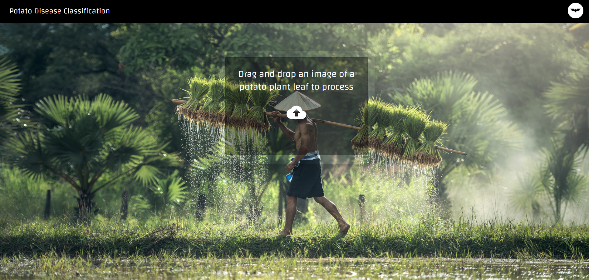
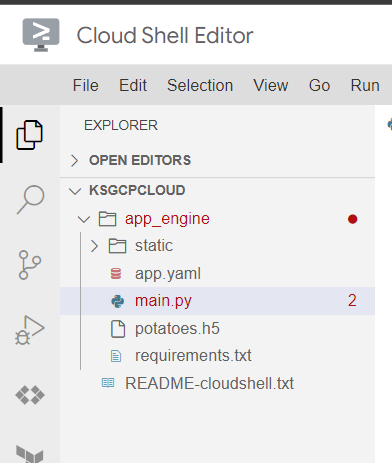

# Project-5-Potato-Disease-Classification


# Introduction - 
This project lets the user upload pictures of plant leaves through the website or the mobile and the project then let's the user know whether the potato plant has any disease or it's healthy.

# Tech stack used - 
1. Python
2. Numpy and pandas for data cleaning
3. Matplotlib for data visualization
4. Sklearn and Tensorflow for model building
5. Jupyter Notebook in VS Code as IDE
6. Python flask/fast api server for http server
7. Node.js and NPM
8. React for website UI
9. React Native for Android App
10. Android Studio for testing android app
11. Google Cloud's App Engine for deployment

# Train the ML model - 
1. Download this repo and run the 'model_creation.ipynb' jupter notebook.
2. After the notebook has run successfully, a 'potatoes.h5' model file will be created in the same directory.
3. Move the model to 'saved_models' folder.

# Deploy the website locally - 
1. Navigate to the frontend folder in both the IDE and the terminal.
2. Run the following command to install all the dependencies.
```
npm install
```
3. Now run the following command to fix dependency issues.
```
npm audit fix
```
4. Now open the 'flask_code.py' file and change the address in the python file to your model in the 'saved_model' folder. Run the python file.
5. Copy the IP address which starts with '127' and ends with '8080', add '/predict' at the end and paste it in the '.env' file. For example - 
```
REACT_APP_API_URL=http://127.0.0.1:8080/predict
```
6. Now open a new terminal window and navigate to the frontend folder and run the following command.
```
npm run start
```
7. Congratulations!! Your website should work now locally.

# Deploy on Google Cloud's App Engine - 
1. Pre-requisites are that you should know the basics of how to operate GCP Console and should have a billing account.
2. Now we need a production ready build for our React website. To build the production ready website, enter the following command.
```
npm run build
```
3. This will create a folder named 'build' which will have a folder named 'static' and other files with it.
4. Move the other files into the 'static' folder.
5. Go to App Engine on Google Cloud Console.
6. Now click on 'Activate Cloud Shell' and then click on 'Open in new window'.
7. Create a folder named 'app_engine' and copy the 'static' folder into it.
8. Copy your 'flask_code.py' file into 'app_engine' folder and rename it to 'main.py'. 
9. Copy the 'app.yaml' and 'requirements.txt' files from the 'gcp' folder in this repo to 'app_engine' folder.
10. Copy your 'potatoes.h5' model file to 'app_engine' folder.
11. Change the model address appropriately in 'main.py'.
12. The final structure should look something like this👇

13. Now open the terminal and set your Google Cloud Project ID using the following command.
```
gcloud config set project [Your project ID here]
```
14. After the project ID is set, navigate to the 'app_engine' folder using the following command.
```
cd app_engine
```
15. Now enter the following command to deploy your project.
```
gcloud app deploy
```
16. The project will be deployed but it won't work
17. Now on Google Cloud Console go to App Engine and click on services on the left pane. You will see a service names default. Click on it.
18. You project will open. Copy the link of the project.
19. Now we need to rebuild our react website using this link. Replace the link in the '.env' file with the URL you copied above and rebuild the react project. For example - 
```
REACT_APP_API_URL=https://pde-2-382419.uc.r.appspot.com/predict
```
20. Now follow step 2 to step 15 again from this section.
21. Your project will be deployed and should work now🥰.
22. To cut additional cost, go to google cloud storage and delete all the buckets associated with this project.
23. Congratulations😁😁!!

#  Create the Android App - 
1. Setup Android Development environment [https://reactnative.dev/docs/environment-setup]
1. Navigate to 'mobile' folder in terminal and in IDE both.
2. 


